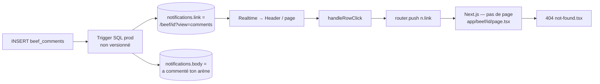

# Rapport d'audit — 404 notifications commentaires

**Date :** 31 mai 2026  
**Contexte :** Bug prod bloquant refonte Profil — clic notification commentaire → `/beef/[id]?view=comments` → **404**  
**Texte signalé :** « a commenté ton arène » (inadapté)  
**Statut :** extraction uniquement — **aucun code modifié**

---

## Synthèse exécutive

| Question | Réponse |
|----------|---------|
| **`app/beef/[id]/page.tsx` existe ?** | **Non** — seul `app/beef/[id]/summary/page.tsx` |
| **Qui construit l’URL `/beef/...?view=comments` ?** | **Pas le front-end** — aucune occurrence dans le dépôt |
| **Qui affiche le lien au clic ?** | `app/notifications/page.tsx` → `router.push(n.link)` (colonne DB `notifications.link`) |
| **D’où vient le texte « a commenté ton arène » ?** | **Pas en dur dans le front** — colonnes DB `notifications.title` / `notifications.body`, probablement **trigger SQL sur `beef_comments`** déployé en prod **hors repo** |
| **Où vivent les commentaires côté app ?** | Feed → `CommentsDrawer` via `activeCommentsBeefId` — **sans deep-link `?view=comments`** |

---

## 1. Cartographie des routes — dossiers racine `app/`

```
admin/
api/
arena/          → app/arena/[roomId]/page.tsx   (arène live WebRTC)
auth/
beef/           → app/beef/[id]/summary/page.tsx UNIQUEMENT
buy-points/
cgu/
create/
feed/           → app/feed/page.tsx             (feed + CommentsDrawer)
forgot-password/
invitations/
live/           → app/live/[id]/page.tsx
login/
messages/
notifications/  → app/notifications/page.tsx
onboarding/
points/
privacy/
profile/
rules/
settings/
share/
signup/
test-daily/
verify-email/
welcome/
```

### Détail critique : arborescence `app/beef/`

```
app/beef/
└── [id]/
    └── summary/
        └── page.tsx    ← seule route sous /beef/[id]
```

**Il n’existe pas** de `app/beef/[id]/page.tsx`.  
Toute navigation vers `/beef/{uuid}` (sans `/summary`) tombe sur `app/not-found.tsx` → **404**.

### Routes beef connues dans le code

| Pattern | Fichier | Usage |
|---------|---------|-------|
| `/arena/{id}` | `app/arena/[roomId]/page.tsx` | Arène live (standard notifications `beef_live`) |
| `/live/{id}` | `app/live/[id]/page.tsx` | Variante live |
| `/beef/{id}/summary` | `app/beef/[id]/summary/page.tsx` | Résumé post-match / replay |
| `/feed` | `app/feed/page.tsx` | Feed + drawer commentaires |

**Aucune route** ne gère `?view=comments` (recherche `view=comments` → **0 occurrence** dans le dépôt).

---

## 2. Source du 404 — routage notification (front-end)

### 2.1 Composant principal : `app/notifications/page.tsx`

Il n’existe **pas** de `components/NotificationsList.tsx`. Toute la liste est inline dans cette page.

**Fetch :** lit `notifications.link` depuis Supabase (pas de construction d’URL côté React pour les commentaires).

**Navigation au clic :** la fonction `handleRowClick` pousse **tel quel** le champ `link` de la base :

```typescript
// app/notifications/page.tsx — handleRowClick (extrait)

const handleRowClick = async (n: AppNotification) => {
  // ... marquage lu (RPC mark_notification_read ou aura_sparks) ...

  // Cas spécial beef_live + invitation pending → /invitations
  if (n.type === 'beef_live' && user?.id && n.metadata && typeof n.metadata === 'object') {
    const beefId = (n.metadata as Record<string, unknown>).beef_id;
    if (typeof beefId === 'string' && beefId.length > 0) {
      const { data: part } = await supabase
        .from('beef_participants')
        .select('invite_status')
        .eq('beef_id', beefId)
        .eq('user_id', user.id)
        .maybeSingle();
      if (part?.invite_status === 'pending') {
        router.push('/invitations');
        return;
      }
    }
  }

  if (n.link) {
    router.push(n.link);   // ← SOURCE DU 404 : URL stockée en DB
  }
};
```

**Affichage texte :** `n.title` et `n.body` rendus directement — pas de template front pour les commentaires :

```typescript
<p className="text-sm font-bold text-white">{n.title}</p>
{n.body ? (
  <p className="text-sm text-gray-400 line-clamp-2">{n.body}</p>
) : null}
```

### 2.2 Interface notification

```typescript
export interface AppNotification {
  id: string;
  created_at: string;
  user_id: string;
  type: NotificationType;
  title: string;
  body: string | null;
  link: string | null;      // ← URL fautive /beef/...?view=comments
  is_read: boolean | null;
  metadata: Record<string, unknown> | null;
}

type NotificationType =
  | 'follow' | 'invite' | 'beef_live' | 'gift' | 'message' | 'system' | 'aura';
```

**Note :** aucun type `'comment'` dans le union TS — si les notifications commentaire existent en prod, elles utilisent probablement `'system'` ou `'message'`, ou le CHECK SQL a été élargi côté prod sans commit repo.

### 2.3 Autres consommateurs de liens notification

| Fichier | Comportement |
|---------|--------------|
| `components/Header.tsx` | Badge + Realtime ; lien nav `/notifications` uniquement |
| `components/BeefNotificationToasts.tsx` | Toasts beef live — liens `/arena/{id}` ou `/beef/{id}/summary` (pas commentaires) |
| `components/MessagesUI.tsx` | Marque notifications `type=message` lues |
| `components/TikTokStyleArena.tsx` | Compte unread `message` — pas de navigation commentaire |

**Recherche globale** `/beef/${...}` sans `/summary` dans le code applicatif : **aucune** construction de `/beef/{id}?view=comments`.

---

## 3. Où les commentaires sont réellement gérés (référence correcte)

### 3.1 Feed — ouverture drawer

```typescript
// app/feed/page.tsx
const [activeCommentsBeefId, setActiveCommentsBeefId] = useState<string | null>(null);

// BeefCard
onCommentClick={() => setActiveCommentsBeefId(beef.id)}

// Montage
{activeCommentsBeefId && (
  <CommentsDrawer
    beefId={activeCommentsBeefId}
    onClose={() => setActiveCommentsBeefId(null)}
  />
)}
```

### 3.2 CommentsDrawer — INSERT sans notification

```typescript
// components/CommentsDrawer.tsx — handleSend
const { error } = await supabase.from('beef_comments').insert({
  beef_id: beefId,
  user_id: user.id,
  content: text,
  parent_id: replyingTo?.commentId ?? null,
});
```

**Aucun** `insert` dans `notifications` côté front après commentaire.  
La notification est donc **presque certainement** créée par un **trigger PostgreSQL AFTER INSERT ON beef_comments** en production.

### 3.3 Deep-link feed existant

Seul query param géré aujourd’hui :

```typescript
// OpenCreateModalFromQuery — app/feed/page.tsx
if (searchParams.get('create') !== '1') return;
```

**Pas de handler** `view=comments` ni `beefId=` pour ouvrir le drawer automatiquement.

---

## 4. Source du texte « a commenté ton arène »

### 4.1 Front-end

Recherche exacte dans le dépôt :

| Pattern | Résultats |
|---------|-----------|
| `a commenté ton arène` | **0** |
| `commenté ton` | **0** |
| `view=comments` | **0** |

**Conclusion :** le libellé n’est **pas** hardcodé dans React/TS.

### 4.2 Triggers SQL versionnés (repo)

Triggers notifications présents dans `supabase_migrations/` :

| Trigger | Table | Types de notif |
|---------|-------|----------------|
| `trigger_notify_new_dm` | `direct_messages` | `message` |
| `trigger_notify_new_follow` | `followers` | `follow` |
| `trigger_notify_beef_invitation` | `beef_invitations` | `invite` |
| `trigger_notify_beef_live` | `beefs` | `beef_live` |
| `trigger_notify_gift` | `gifts` | `gift` |

**Aucun trigger** `beef_comments` / `notify_new_comment` dans :
- `supabase_migrations/23_notifications.sql`
- `supabase_migrations/25_notification_triggers.sql`
- `supabase_migrations/28_full_notifications_fix.sql`
- `supabase_migrations/init.sql`

**Aucune occurrence** de `'/beef/'` dans les fichiers `.sql` du repo (les liens beef live pointent vers `'/arena/' || NEW.id`).

### 4.3 Schéma table `notifications` (CHECK types)

```sql
-- supabase_migrations/23_notifications.sql
type TEXT NOT NULL CHECK (type IN ('follow', 'invite', 'beef_live', 'gift', 'message', 'system')),
title TEXT NOT NULL,
body TEXT,
link TEXT,
```

### 4.4 Hypothèse prod (à confirmer côté Supabase)

Le trigger commentaire a probablement été appliqué **directement en prod** (SQL Editor / migration non commitée) avec un corps du type :

```sql
-- HYPOTHÈSE — non présente dans le repo, à vérifier en prod
INSERT INTO notifications (user_id, type, title, body, link, metadata)
VALUES (
  v_recipient_id,
  'system',  -- ou 'message'
  v_sender_name || ' a commenté ton arène',
  left(NEW.content, 120),
  '/beef/' || NEW.beef_id || '?view=comments',
  jsonb_build_object('beef_id', NEW.beef_id, 'comment_id', NEW.id)
);
```

**Requêtes de vérification recommandées (Supabase SQL Editor) :**

```sql
-- 1. Lister les triggers sur beef_comments
SELECT tgname, pg_get_triggerdef(oid)
FROM pg_trigger
WHERE tgrelid = 'public.beef_comments'::regclass AND NOT tgisinternal;

-- 2. Inspecter une notification commentaire récente
SELECT id, type, title, body, link, metadata, created_at
FROM notifications
WHERE link LIKE '%view=comments%'
ORDER BY created_at DESC
LIMIT 5;

-- 3. Fonctions notify_* contenant "comment"
SELECT proname, prosrc
FROM pg_proc
WHERE prosrc ILIKE '%comment%' AND prosrc ILIKE '%notification%';
```

---

## 5. Chaîne de causalité du bug



---

## 6. Écart architecture attendue vs prod

| Couche | Attendu (Phase 11 commentaires) | Prod (bug) |
|--------|----------------------------------|------------|
| UI commentaires | `/feed` + `CommentsDrawer` | Lien `/beef/[id]?view=comments` |
| Route Next | `/feed` (drawer state local) | Route inexistante sous `/beef/[id]` |
| Wording | « a commenté sur ton beef » / « sur ta carte » ? | « a commenté ton arène » (confusion arène vs feed) |
| Source lien | Devrait être `/feed?...` ou hash | Généré en SQL, non aligné app router |

---

## 7. Piste de correctif (hors scope — pour l’Architecte)

Sans implémenter, les options cohérentes avec le code actuel :

1. **SQL trigger** : remplacer `link` par `/feed?beef={id}&view=comments` (ou `/feed?view=comments&beefId={id}`).
2. **Feed** : ajouter un `useEffect` lisant `searchParams` pour `setActiveCommentsBeefId`.
3. **Texte** : remplacer « ton arène » par « ton beef » / « ta carte » selon copy validée.
4. **Versionner** la migration trigger dans `supabase_migrations/` pour aligner repo ↔ prod.

---

## 8. Fichiers audités (référence)

| Fichier | Rôle audit |
|---------|------------|
| `app/notifications/page.tsx` | Navigation `router.push(n.link)` |
| `app/feed/page.tsx` | Drawer commentaires (cible correcte) |
| `components/CommentsDrawer.tsx` | INSERT commentaire (sans notif front) |
| `app/beef/[id]/summary/page.tsx` | Seule route `/beef/*` existante |
| `app/not-found.tsx` | Page 404 affichée |
| `supabase_migrations/23_notifications.sql` | Schéma + CHECK types |
| `supabase_migrations/28_full_notifications_fix.sql` | Triggers versionnés |

---

*Rapport généré pour déblocage Phase Profil — extraction brute, aucune modification de code.*
