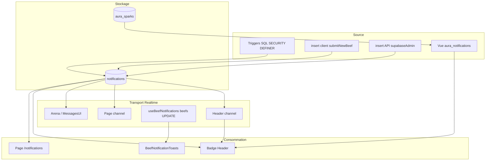

# Rapport d'audit — Système de Notifications

**Date :** 31 mai 2026  
**Objectif :** cartographier création → transport Realtime → consommation UI ; détecter spam, latence, ghost unread  
**Statut :** exploration uniquement (aucun correctif)

---

## 1. Architecture globale

Il n'existe **pas** de `NotificationContext` centralisé. Le cycle de vie est **distribué** entre :

| Couche | Fichiers clés |
|--------|----------------|
| **SQL / triggers** | `supabase_migrations/23_notifications.sql`, `28_full_notifications_fix.sql`, `42_manifesto_beef_intent.sql`, `41_mark_notifications_read_rpc.sql`, `40_badge_unread_counts_rpc.sql`, `54_radar_aura_dynamic.sql`, `55_aura_sparks_receiver_column.sql` |
| **Insertions manuelles** | `lib/submitNewBeef.ts`, `app/api/beef/manage/route.ts` |
| **Transport Realtime** | `components/Header.tsx`, `app/notifications/page.tsx`, `hooks/useBeefNotifications.ts`, `components/TikTokStyleArena.tsx`, `components/MessagesUI.tsx` |
| **UI** | `components/Header.tsx` (badge cloche), `app/notifications/page.tsx`, `components/BeefNotificationToasts.tsx` |

Montage global : `BeefNotificationToasts` est rendu dans `Header.tsx` (l. ~383), pas dans `app/layout.tsx`.

---

## 2. La Source — Création en base

### 2.1 Structure de la table

**Fichier :** `supabase_migrations/23_notifications.sql` (consolidé dans `28_full_notifications_fix.sql`)

```sql
CREATE TABLE IF NOT EXISTS notifications (
  id UUID PRIMARY KEY DEFAULT uuid_generate_v4(),
  created_at TIMESTAMP WITH TIME ZONE DEFAULT NOW(),
  user_id UUID NOT NULL REFERENCES users(id) ON DELETE CASCADE,
  type TEXT NOT NULL CHECK (type IN ('follow', 'invite', 'beef_live', 'gift', 'message', 'system')),
  title TEXT NOT NULL,
  body TEXT,
  link TEXT,
  is_read BOOLEAN DEFAULT false,
  metadata JSONB DEFAULT '{}'
);

CREATE INDEX IF NOT EXISTS idx_notifications_user ON notifications(user_id);
CREATE INDEX IF NOT EXISTS idx_notifications_read ON notifications(user_id, is_read);
```

**Note :** le type `'aura'` est utilisé côté TypeScript (`app/notifications/page.tsx`) mais **absent** du `CHECK` SQL — les étincelles Radar passent par la vue `aura_notifications`, pas par cette table.

### 2.2 Realtime publication

**Fichier :** `supabase_migrations/28_full_notifications_fix.sql` (l. 58–73)

```sql
  IF NOT EXISTS (
    SELECT 1 FROM pg_publication_tables 
    WHERE pubname = 'supabase_realtime' AND tablename = 'notifications'
  ) THEN
    ALTER PUBLICATION supabase_realtime ADD TABLE notifications;
  END IF;
```

### 2.3 Triggers PostgreSQL automatisés

**Fichier :** `supabase_migrations/28_full_notifications_fix.sql` (section 5)

| Trigger | Table source | Événement | Destinataire | Type |
|---------|--------------|-----------|--------------|------|
| `trigger_notify_new_dm` | `direct_messages` | INSERT | Autre participant conv. | `message` |
| `trigger_notify_new_follow` | `followers` | INSERT | Personne suivie | `follow` |
| `trigger_notify_beef_invitation` | `beef_invitations` | INSERT | Invité | `invite` |
| `trigger_notify_invitation_response` | `beef_invitations` | UPDATE status | Inviteur | `invite` |
| `trigger_notify_beef_live` | `beefs` | UPDATE → `live` | Participants + followers médiateur | `beef_live` |
| `trigger_notify_gift` | `gifts` | INSERT | Destinataire (`recipient_id`) | `gift` |

**Extrait — nouveau DM :**

```sql
CREATE OR REPLACE FUNCTION notify_new_dm()
RETURNS TRIGGER AS $$
...
  IF recipient IS NOT NULL THEN
    INSERT INTO notifications (user_id, type, title, body, link, metadata)
    VALUES (
      recipient, 
      'message', 
      'Nouveau message', 
      sender_name || ' t''a envoyé un message', 
      '/messages', 
      jsonb_build_object('sender_id', NEW.sender_id, 'conversation_id', NEW.conversation_id)
    );
  END IF;
...
$$ LANGUAGE plpgsql SECURITY DEFINER;
```

**Extrait — beef passe en live (version manifesto corrigée, migration 42) :**

```sql
  IF OLD.status IS DISTINCT FROM 'live' AND NEW.status = 'live' THEN
    ...
    FOR p_record IN
      SELECT user_id FROM beef_participants
      WHERE beef_id = NEW.id AND user_id IS DISTINCT FROM v_presenter
    LOOP
      INSERT INTO notifications (user_id, type, title, body, link, metadata)
      VALUES (p_record.user_id, 'beef_live', 'Beef en direct !', ...);
    END LOOP;

    FOR p_record IN
      SELECT follower_id FROM followers WHERE following_id = v_presenter
    LOOP
      INSERT INTO notifications (user_id, type, title, body, link, metadata)
      VALUES (p_record.follower_id, 'beef_live', ...)
      ON CONFLICT DO NOTHING;  -- ⚠️ sans contrainte UNIQUE explicite sur (user_id, beef_id, type)
    END LOOP;
  END IF;
```

**Risque spam live :** chaque follower du présentateur reçoit une ligne `beef_live` à chaque passage `→ live`. Pas de déduplication garantie côté SQL.

### 2.4 Insertions manuelles (client / API)

**Créateur après création beef — `lib/submitNewBeef.ts` :**

```typescript
  await Promise.allSettled([
    supabase.from('notifications').insert({
      user_id: userId,
      type: 'system',
      title: beefData.intent === 'manifesto' ? 'Manifeste publié !' : 'Convocations envoyées !',
      body: ...,
      link: `/arena/${beef.id}`,
      metadata: { subtype: 'beef_created', beef_id: beef.id, intent: beefData.intent },
    }),
  ]);
```

Les invitations passent par le trigger `trigger_notify_beef_invitation` (commentaire l. 169–170).

**Validation manifesto Ref — `app/api/beef/manage/route.ts` (service role) :**

```typescript
        await supabaseAdmin.from('notifications').insert({
          user_id: beef.mediator_id,
          type: 'system',
          title: 'Candidature validée !',
          body: msg,
          link: `/arena/${beefId}`,
          metadata: { subtype: 'manifesto_approved', related_id: beefId },
        });
```

### 2.5 RLS — qui peut insérer ?

**Phase 6 — `supabase_migrations/31_phase6_rls_hardening.sql` :**

```sql
CREATE POLICY "Users insert own notifications only"
  ON public.notifications FOR INSERT
  WITH CHECK (auth.uid() = user_id);
```

Les triggers `SECURITY DEFINER` contournent le RLS. Le client ne peut insérer que pour **soi-même** (confirmation créateur OK).

### 2.6 Radar Aura (hors table `notifications`)

**Vue — `supabase_migrations/55_aura_sparks_receiver_column.sql` :**

```sql
CREATE VIEW public.aura_notifications
WITH (security_invoker = true) AS
SELECT
  ('spark-' || s.id::text)::text AS id,
  s.receiver_id AS user_id,
  s.created_at,
  ...
FROM public.aura_sparks s
INNER JOIN public.users gu ON gu.id = s.giver_id;
```

Pas de colonne `is_read`. Les étincelles sont **persistantes** et comptées comme « non lues » tant qu'elles existent.

---

## 3. Le Transport — Realtime React

### 3.1 Header — badge cloche + toast navigateur

**Fichier :** `components/Header.tsx` (l. 291–335)

```typescript
    const channel = supabase
      .channel(`header_badges_${user.id}`)
      .on(
        'postgres_changes',
        { event: 'INSERT', schema: 'public', table: 'beef_invitations', filter: `invitee_id=eq.${user.id}` },
        () => {
          void headerCallbacksRef.current.loadUnreadCounts();
          headerCallbacksRef.current.toast('Nouvelle invitation reçue !', 'info');
        }
      )
      .on(
        'postgres_changes',
        { event: 'INSERT', schema: 'public', table: 'notifications', filter: `user_id=eq.${user.id}` },
        (payload) => {
          const n = payload.new as { type?: string; body?: string; title?: string };
          const prefs = getNotifPrefs();
          const typeMap: Record<string, string> = {
            message: 'messages', follow: 'follows', invite: 'invites',
            beef_live: 'beefs_live', gift: 'gifts', aura: 'aura',
          };
          const prefKey = typeMap[n.type || ''];
          if (prefKey && prefs[prefKey] === false) return;

          void headerCallbacksRef.current.loadUnreadCounts();
          showBrowserNotification(n.title || 'Beefs', n.body || '');
        }
      )
      .on(
        'postgres_changes',
        { event: 'UPDATE', schema: 'public', table: 'notifications', filter: `user_id=eq.${user.id}` },
        () => {
          void headerCallbacksRef.current.loadUnreadCounts();
        }
      )
      .subscribe();
```

**Comportement :**

- **Immédiat** — pas de debounce (contrairement au feed `beefs_changes` 1500 ms).
- Chaque INSERT déclenche un **refetch RPC complet** (`loadUnreadCounts`).
- Préférences `localStorage` `beefs_notif_prefs` filtrent toast navigateur par type.
- `showBrowserNotification` ne s'affiche que si `!document.hasFocus()`.

**Resync additionnel :**

- `beefs:badges-refresh` (CustomEvent)
- `visibilitychange` → refetch si onglet visible
- `pathname` change → refetch

### 3.2 Page `/notifications`

**Fichier :** `app/notifications/page.tsx` (l. 126–167)

```typescript
    const channel = supabase
      .channel(`notifications:${user.id}`)
      .on(
        'postgres_changes',
        { event: 'INSERT', schema: 'public', table: 'notifications', filter: `user_id=eq.${user.id}` },
        (payload) => {
          const row = payload.new as AppNotification;
          setNotifications((prev) => {
            if (prev.some((n) => n.id === row.id)) return prev;
            return [row, ...prev];
          });
        }
      )
      .on(
        'postgres_changes',
        { event: 'UPDATE', schema: 'public', table: 'notifications', filter: `user_id=eq.${user.id}` },
        (payload) => {
          const row = payload.new as AppNotification;
          setNotifications((prev) =>
            prev.map((n) => (n.id === row.id ? row : n))
          );
        }
      )
      .subscribe();
```

**Immédiat**, mise à jour optimiste de la liste locale. **N'écoute pas** `aura_sparks` ni `aura_notifications`.

### 3.3 Toasts beef live (hors table `notifications`)

**Fichier :** `hooks/useBeefNotifications.ts` (l. 46–98)

```typescript
    const channel = supabase
      .channel(`beef_notifications_${userId}`)
      .on(
        'postgres_changes',
        {
          event: 'UPDATE',
          schema: 'public',
          table: 'beefs',
        },
        (payload) => {
          ...
          if (newStatus === 'live' && oldStatus !== 'live') {
            ...
            onNotification({ beefId: bid, title: beef.title as string, type: 'live_now' });
            showBrowserNotification(`🔴 LIVE maintenant!`, ...);
          }
        }
      )
      .subscribe();
```

**Failles transport :**

- Canal **sans filtre** sur `beefs` — reçoit **tous** les UPDATE de tous les beefs du projet.
- Déduplication locale par clé `${beef.id}_${oldStatus}_to_${newStatus}` uniquement.
- Parallèle au trigger SQL `beef_live` → **double alerte** possible (ligne DB + toast navigateur + `BeefNotificationToasts` UI).

### 3.4 Arène — compteur DM dérivé des notifications

**Fichier :** `components/TikTokStyleArena.tsx` (l. 435–469)

Écoute INSERT/UPDATE sur `notifications` filtré `type === 'message'`, incrémente/décrémente un compteur local. **Ne compte pas** les `direct_messages` directement (différent du badge Messages du Header).

### 3.5 Messages — marquage lecture en temps réel

**Fichier :** `components/MessagesUI.tsx` (l. 262–273)

Sur INSERT DM dans conv ouverte : marque le message **et** bulk-update les notifications `type=message` liées à `conversation_id` — sans `beefs:badges-refresh` sur ce chemin Realtime (seulement au `loadMessages`).

---

## 4. La Consommation — UI & compteur non-lus

### 4.1 Règle « non lu »

**Fichier :** `lib/notification-unread.ts`

```typescript
export function isNotificationUnread(row: { is_read?: boolean | null }): boolean {
  return row.is_read !== true;
}
```

Aligné SQL : `is_read IS DISTINCT FROM true` (`40_badge_unread_counts_rpc.sql`).

### 4.2 Badge Header (cloche)

**Fichier :** `components/Header.tsx` (l. 199–233)

```typescript
  const loadUnreadCounts = useCallback(async () => {
    ...
    const [invRes, notifRpc, dmRpc, auraUnreadRes] = await Promise.all([
      supabase.from('beef_invitations').select('id', { count: 'exact', head: true })...,
      supabase.rpc('count_unread_notifications'),
      supabase.rpc('count_unread_direct_messages'),
      supabase
        .from('aura_notifications')
        .select('id', { count: 'exact', head: true })
        .eq('user_id', user.id),
    ]);
    ...
    setUnreadNotifications(systemUnread + auraRows);
```

**RPC SQL :**

```sql
CREATE OR REPLACE FUNCTION public.count_unread_notifications()
...
  SELECT count(*)::integer
  FROM public.notifications
  WHERE user_id = auth.uid()
    AND is_read IS DISTINCT FROM true;
```

**Désalignement :** le badge **additionne** `notifications` non lues + **toutes** les lignes `aura_notifications` (aucun filtre lu/non-lu possible — pas de `is_read` sur `aura_sparks`).

### 4.3 Page notifications — compteur local

**Fichier :** `app/notifications/page.tsx` (l. 249)

```typescript
  const unreadCount = notifications.filter(isNotificationUnread).length;
```

Basé **uniquement** sur le fetch `notifications` (limit 4000). **N'inclut pas** `aura_notifications`.

### 4.4 Marquer comme lu

**RPC serveur — `supabase_migrations/41_mark_notifications_read_rpc.sql` :**

```sql
CREATE OR REPLACE FUNCTION public.mark_all_notifications_read()
...
  UPDATE public.notifications
  SET is_read = true
  WHERE user_id = auth.uid()
    AND is_read IS DISTINCT FROM true;

CREATE OR REPLACE FUNCTION public.mark_notification_read(p_id uuid)
...
  UPDATE public.notifications
  SET is_read = true
  WHERE id = p_id AND user_id = auth.uid();
```

**Page — tout marquer lu :**

```typescript
      const { error: rpcErr } = await supabase.rpc('mark_all_notifications_read');
      if (rpcErr) {
        const { error: upErr } = await supabase
          .from('notifications')
          .update({ is_read: true })
          .eq('user_id', user.id)
          .or('is_read.is.null,is_read.eq.false');
      }
      setNotifications((prev) => prev.map((n) => ({ ...n, is_read: true })));
      window.dispatchEvent(new CustomEvent('beefs:badges-refresh'));
```

**Clic ligne — spark Aura (client only) :**

```typescript
    const isSparkRow = n.type === 'aura' || n.id.startsWith('spark-');
    if (!n.is_read && !isSparkRow) {
      await supabase.rpc('mark_notification_read', { p_id: n.id });
      ...
    } else if (!n.is_read && isSparkRow) {
      setNotifications((prev) => prev.map(...)); // local only, pas de RPC
    }
```

**Note :** les sparks n'apparaissent pas dans le fetch actuel — branche `isSparkRow` **anticipée** mais probablement inactive en prod.

### 4.5 Synchronisation inter-composants

| Mécanisme | Émetteur | Récepteur |
|-----------|----------|-----------|
| `beefs:badges-refresh` | Page notifications, MessagesUI | Header `loadUnreadCounts` |
| Realtime INSERT/UPDATE | Postgres | Header, page notifications |
| `visibilitychange` | Browser | Header refetch |
| Optimistic local | Page notifications | Badge après event |

Pas de store partagé — risque de **état fantôme** entre page ouverte et badge header si l'event n'est pas émis.

---

## 5. Composants UI

| Composant | Rôle |
|-----------|------|
| `Header.tsx` | Icône Bell + badge `unreadNotifications` ; lien `/notifications` |
| `app/notifications/page.tsx` | Liste chronologique, « Tout marquer comme lu », navigation via `link` |
| `BeefNotificationToasts.tsx` | Toasts flottants live / starting_soon / ended (via `useBeefNotifications`, pas la table SQL) |
| `MessagesUI.tsx` | Marque notifications `message` lues à l'ouverture conv. |
| `TikTokStyleArena.tsx` | Badge DM arène basé sur notifications `message` |

Pas de dropdown cloche — navigation directe vers la page dédiée.

---

## 6. Observations — failles de synchronisation & risques

### 6.1 Ghost unread (badge > liste)

| Cause | Gravité |
|-------|---------|
| Badge = `count_unread_notifications` + **count total** `aura_notifications` | **Élevée** — étincelles Radar gonflent le badge sans entrée dans `/notifications` |
| Page ne merge pas `aura_notifications` | **Élevée** — l'utilisateur ne peut pas « vider » le badge Aura depuis la page |
| `mark_all_notifications_read` n'affecte pas `aura_sparks` | **Élevée** — « Tout marquer comme lu » laisse le composant Aura du badge |

### 6.2 Double notification live

| Canal | Effet |
|-------|--------|
| Trigger SQL `notify_beef_live` | INSERT `notifications` + Realtime Header + page |
| `useBeefNotifications` | Toast UI + `Notification` API navigateur |
| Header INSERT handler | Second toast navigateur si prefs OK |

Un passage `→ live` peut produire **3 surfaces** d'alerte pour le même événement.

### 6.3 Spam / volume

| Source | Risque |
|--------|--------|
| `notify_beef_live` → tous les followers | N notifications par beef live (N = taille audience) |
| `notify_new_dm` → 1 notif par message | Spam si conversation active ; atténué partiellement si conv ouverte (MessagesUI) |
| `useBeefNotifications` sans filtre `beefs` | Charge Realtime client sur **chaque** UPDATE beef global |

### 6.4 Latence

- Notifications table : **immédiat** (pas de debounce).
- Header : refetch RPC **complet** à chaque INSERT/UPDATE — acceptable pour volume faible, coûteux si rafale (live massif, DMs groupés).
- Feed `beefs_changes` debounce 1500 ms **n'affecte pas** les notifications.

### 6.5 Compteurs incohérents entre surfaces

| Surface | Messages non lus |
|---------|------------------|
| Header badge Messages | `count_unread_direct_messages()` (table `direct_messages`) |
| TikTokStyleArena | Count `notifications` type `message` |
| MessagesUI | `unread_count` par conversation sur `direct_messages` |

Trois définitions différentes — désync possible si notification `message` lue mais DM non (ou inverse).

### 6.6 Race mark-as-read vs Realtime

1. User clique « Tout marquer comme lu » → optimistic local + RPC.
2. INSERT Realtime arrive avant fin RPC → Header refetch → badge remonte.
3. Mitigation partielle : refetch après event, pas de verrou optimiste Header.

### 6.7 Types & contraintes

- Type TS `'aura'` vs CHECK SQL sans `'aura'` — étincelles hors table.
- `ON CONFLICT DO NOTHING` sur insert follower live sans index unique documenté — déduplication incertaine.

### 6.8 Absence de contexte global

Pas de `NotificationContext` — logique dupliquée (3+ abonnements `postgres_changes` sur `notifications` par session : Header, page si ouverte, Arène). Risque de fuites si channels mal nettoyés (cleanup présent via `removeChannel`).

---

## 7. Cartographie du cycle de vie (résumé)



---

## 8. Pistes d'audit Phase suivante (sans implémentation)

1. Unifier badge et page : fusionner `notifications` + `aura_notifications` ou exclure Aura du badge cloche.
2. Dédupliquer live : choisir **soit** trigger SQL **soit** `useBeefNotifications` pour l'UX toast.
3. Filtrer Realtime `beefs` par `mediator_id` / participants / followers.
4. Ajouter `is_read` ou table junction pour `aura_sparks`, ou RPC dédié « dismiss spark ».
5. Aligner compteur Messages Header / Arène / MessagesUI sur une seule RPC.
6. Debounce optionnel Header `loadUnreadCounts` si rafale live.
7. Étendre CHECK `type` ou documenter séparation Radar vs inbox.

---

**Fin du rapport — prêt pour plan Architecte module Notifications.**
