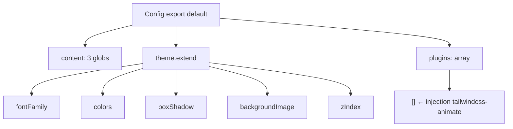

# Audit source — Configuration Tailwind CSS

> **Mission :** extraction à zéro modification pour préparer l'injection de `tailwindcss-animate`.  
> **Date :** 2026-05-31  
> **Fichier source :** `tailwind.config.ts` (racine du projet)

---

## 1. Synthèse

| Élément | Détail |
|---------|--------|
| **Fichier config** | `tailwind.config.ts` (TypeScript, export default) |
| **PostCSS** | `postcss.config.js` — `tailwindcss` + `autoprefixer` |
| **Version Tailwind** | `^3.3.0` (`package.json`) |
| **Plugin cible** | `tailwindcss-animate` `^1.0.7` — **installé, non branché** |
| **Tableau `plugins`** | **`[]` (vide)** — point d'injection sans conflit |
| **Fichier alternatif** | Aucun `tailwind.config.js` — un seul fichier de config |

---

## 2. Structure de l'objet de configuration



| Clé racine | Type | Rôle |
|------------|------|------|
| `content` | `string[]` | Scan `./pages/**`, `./components/**`, `./app/**` |
| `theme.extend` | objet | Tokens design Beefs (sans écraser le preset Tailwind) |
| `plugins` | `array` | **Vide** — aucun plugin tiers actif |

**Pattern :** `theme.extend` (et non `theme` direct) — l'injection du plugin **ne touche pas** aux extensions de thème existantes.

---

## 3. Tokens personnalisés à préserver (Ordre de Frappe)

### 3.1 `theme.extend.fontFamily`

| Clé | Valeur |
|-----|--------|
| `sans` | `var(--font-space-grotesk)`, fallback sans-serif |
| `mono` | `var(--font-jetbrains-mono)`, fallback monospace |

### 3.2 `theme.extend.colors`

| Palette | Clés | Usage typique |
|---------|------|---------------|
| `obsidian` | `DEFAULT`, `950`, `900` | Fonds arène / dark UI |
| `cyan` | `DEFAULT`, `200`–`600` | Accent premium, focus rings |
| `blood` | `DEFAULT`, `400`–`600` | Accents rouges |
| `volt` | `DEFAULT`, `400`, `500` | Accents jaune-vert |
| `prestige.gold` | `#E5C07B` | Or prestige |
| `brand` | `400`–`600` | Cyan brand Spatial Monolith |

**Note Architecte :** les classes `ember-*` (Toast, Header, Arena) sont **utilisées dans les composants** mais **absentes** de `tailwind.config.ts`. Elles ne seront pas impactées par l'ajout du plugin ; une extension `ember` pourrait être un chantier séparé.

### 3.3 `theme.extend.boxShadow`

- `glow-brand`, `glow-mediator`, `glow-cyan`, `glow-blood`, `card`

### 3.4 `theme.extend.backgroundImage`

- `brand-gradient`

### 3.5 `theme.extend.zIndex`

- `base`, `overlay`, `modal`, `arena-hud`, `toast`, `critical`

---

## 4. Point d'injection — `plugins`

### État actuel (L70)

```typescript
plugins: [],
```

### Ordre de Frappe recommandé (sans écraser le thème)

**Option A — require CommonJS (compatible PostCSS actuel) :**

```typescript
plugins: [require("tailwindcss-animate")],
```

**Option B — import ESM (si migration TS stricte) :**

```typescript
import tailwindcssAnimate from "tailwindcss-animate";
// …
plugins: [tailwindcssAnimate],
```

**Fichiers à modifier (prévu) :** uniquement `tailwind.config.ts` — **ne pas toucher** `theme.extend`.

---

## 5. Consommateurs des classes `animate-*` (post-plugin)

| Fichier | Classes Radix data-state |
|---------|--------------------------|
| `components/Header.tsx` L604 | `data-[state=open]:animate-in`, `animate-out`, `fade-in-0`, `fade-out-0`, `zoom-in-95`, `zoom-out-95`, `slide-in-from-top-2`, `slide-in-from-bottom-2` |

Ces utilitaires sont fournis par `tailwindcss-animate` — **inactifs tant que le plugin n'est pas dans `plugins`**.

---

## 6. Chaîne PostCSS (contexte)

**Fichier :** `postcss.config.js`

```javascript
module.exports = {
  plugins: {
    tailwindcss: {},
    autoprefixer: {},
  },
};
```

Aucune modification PostCSS requise pour `tailwindcss-animate` (plugin Tailwind natif, pas PostCSS).

---

## 7. Dépendances — vérification

```json
"tailwindcss": "^3.3.0",
"tailwindcss-animate": "^1.0.7"
```

**Statut :** les deux packages sont présents dans `package.json` / `package-lock.json`.

---

## 8. Checklist post-injection

- [ ] Ajouter `tailwindcss-animate` dans `plugins` sans modifier `theme.extend`
- [ ] Redémarrer le serveur dev (`npm run dev`) pour recharger la config
- [ ] Vérifier animation ouverture/fermeture dropdown Header (Radix)
- [ ] Confirmer que les couleurs `obsidian`, `cyan`, `brand`, etc. restent inchangées
- [ ] `npx tsc --noEmit` (config TS — pas de régression attendue)

---

## 9. Code source brut — `tailwind.config.ts`

```typescript
import type { Config } from "tailwindcss";

const config: Config = {
  content: [
    "./pages/**/*.{js,ts,jsx,tsx,mdx}",
    "./components/**/*.{js,ts,jsx,tsx,mdx}",
    "./app/**/*.{js,ts,jsx,tsx,mdx}",
  ],
  theme: {
    extend: {
      fontFamily: {
        sans: ["var(--font-space-grotesk)", "sans-serif"],
        mono: ["var(--font-jetbrains-mono)", "monospace"],
      },
      colors: {
        obsidian: {
          DEFAULT: "#030305",
          950: "#010102",
          900: "#07070A",
        },
        cyan: {
          DEFAULT: "#00F0FF",
          200: "#B9FFFF",
          300: "#7DFFFF",
          400: "#4DFFFF",
          500: "#00F0FF",
          600: "#00B3CC",
        },
        blood: {
          DEFAULT: "#FF003C",
          400: "#FF3363",
          500: "#FF003C",
          600: "#CC0030",
        },
        volt: {
          DEFAULT: "#DFFF00",
          400: "#E6FF4D",
          500: "#DFFF00",
        },
        prestige: {
          gold: "#E5C07B",
        },
        /** Brand Spatial Monolith — Cyan premium */
        brand: {
          400: "#00F0FF",
          500: "#00B3CC",
          600: "#008B99",
        },
      },
      boxShadow: {
        "glow-brand": "0 0 20px rgba(0, 240, 255, 0.4)",
        "glow-mediator": "0 0 20px rgba(212, 175, 55, 0.6)",
        "glow-cyan": "0 0 20px rgba(0, 240, 255, 0.4)",
        "glow-blood": "0 0 20px rgba(255, 0, 60, 0.6)",
        card: "0 1px 0 rgba(255,255,255,0.06), 0 8px 32px rgba(0,0,0,0.5)",
      },
      backgroundImage: {
        "brand-gradient": "linear-gradient(135deg, #00F0FF 0%, #00B3CC 100%)",
      },
      zIndex: {
        base: "10",
        overlay: "50",
        modal: "100",
        "arena-hud": "200",
        toast: "300",
        critical: "999",
      },
    },
  },
  plugins: [],
};
export default config;
```

---

## 10. Code source brut — `postcss.config.js` (référence)

```javascript
module.exports = {
  plugins: {
    tailwindcss: {},
    autoprefixer: {},
  },
};
```

---

*Extraction terminée — aucune modification du code source applicatif.*
