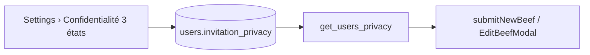
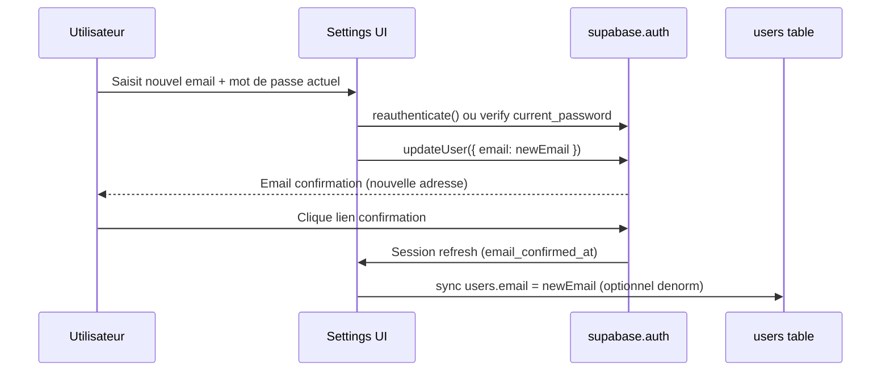

# Rapport — Destruction / Reconstruction du pôle Identité

**Date :** 31 mai 2026  
**Nature :** audit fonctionnel croisé **sans modification de code**  
**Périmètre :** `app/settings/page.tsx` · `app/profile/ProfileContent.tsx` · `app/profile/[username]/page.tsx`  
**Objectif :** feuille de route pour une réécriture totale Tier-1 (UX, email, confidentialité, dé-duplication profil public/privé)

---

## 1. Synthèse exécutive

Le pôle Identité est aujourd’hui **trois monolithes couplés** (~1 325 + ~1 675 + ~1 182 lignes) avec :

| Dette | Gravité | Impact |
|-------|---------|--------|
| Duplication JSX profil privé / public / aperçu | **P0** | 3 variantes du même header, styles divergents, régressions visuelles |
| Retraits financiers dans le profil privé | **P0** | Pollution vitrine sociale ; chevauchement partiel avec Settings › Portefeuille |
| Pas de changement d’email | **P0** | Champ lecture seule + message « fournisseur d’auth » — fonctionnalité attendue absente |
| Bouclier + médiation locale redondants | **P1** | Deux concepts UX pour la « confidentialité » ; `beefs_mediation_access` sans effet serveur |
| Pseudo immuable, nom affiché éditable à deux endroits | **P1** | Settings vs profil ; risque d’incohérence |
| `invitation_privacy` sauvé via bouton « Enregistrer profil » | **P1** | UX confuse (onglet Profil vs carte Bouclier) |
| Stat « Vues totales » toujours à 0 | **P2** | Dette affichage / requête manquante |
| Incohérence nommage onglets | **P2** | Privé : « Affaires » / Public : « Médiations » + « Affaires » inversés |

**Recommandation Architecte :** réécriture par **extraction de composants partagés** + **consolidation des domaines** (Identité sociale vs Portefeuille vs Sécurité compte), pas un simple refactor CSS.

---

## 2. Cartographie des fichiers

```
app/profile/page.tsx          → garde-fou auth, délègue à ProfileContent
app/profile/ProfileContent.tsx → profil PRIVÉ (owner) — upload média, stats, retraits, preview
app/profile/[username]/page.tsx → profil PUBLIC — follow, lightbox, Vox Populi
app/settings/page.tsx         → identité partielle, sécurité OTP, portefeuille (tx), préférences
```

### Routes utilisateur

| URL | Rôle |
|-----|------|
| `/profile` | Mon profil (privé) |
| `/profile/{username}` | Vitrine publique (+ ancres `#beefs`, `#followers`, …) |
| `/settings` | Paramètres compte (onglets Profil · Sécurité · Portefeuille · …) |

---

## 3. Analyse de duplication — Profil privé vs public

### 3.1 Blocs JSX dupliqués (cible extraction `ProfileLayoutShell`)

Comparaison ligne à ligne des **sections structurelles** communes :

| Bloc | ProfileContent (privé) | [username]/page (public) | Divergences notables |
|------|------------------------|--------------------------|----------------------|
| **Conteneur header** | `rounded-[2rem] bg-white/[0.04] border … backdrop-blur-2xl` (L662) | `bg-gradient-to-br from-gray-800/50 … border-gray-700 rounded-3xl` (L648) | **Styles différents** — pas un design system unifié |
| **Bannière h-48** | `Image` + overlay upload `Camera` (L664–684) | `Image` cliquable → lightbox (L654–667) | Privé : édition · Public : consultation + likes média |
| **AppBackButton** | Identique pattern (L665–666) | Identique (L651–652) | ✅ Duplication exacte |
| **Avatar 128px overlap -mt-16** | `rounded-[2rem]` + upload (L689–715) | `rounded-full` + lightbox (L676–693) | **Forme différente** (carré arrondi vs cercle) |
| **Barre d’actions** | Share · Eye (preview) · Link Settings (L718–750) | Share · Report · FollowButton · Link Modifier si own (L696–777) | Slots `actions` différents — même emplacement |
| **Identité** | `h1` display_name · `@username` · bio (L755–763) | Idem (L782–789) | ✅ Quasi identique |
| **Bloc Aura** | rank badge + InlineAuraGivers + compteur (L765–797) | Idem (L792–824) | ✅ Quasi identique (commentaire « Lingots ≠ affichés » public) |
| **Métriques sociales** | Affaires · Médiations · **Réputation** · Abonnés · Abonnements (L800–824) | Affaires · Médiations · Abonnés · Abonnements (L827–844) | Privé : + `beefs_abandoned` ; liens navigation différents |
| **Date d’inscription** | ❌ Absent | ✅ Présent (L847–849) | À ajouter au layout partagé (optionnel public) |

**Estimation duplication header :** ~120–150 lignes × **3 occurrences** (privé, public, modal aperçu public L1500–1592) = **~360–450 lignes** extractibles.

### 3.2 Troisième copie : modal « Aperçu public » (ProfileContent)

Le composant privé embarque un **mini-clone** du profil public (L1472–1653) :

- Bannière + avatar + identité + Aura + métriques
- Section Vox Populi (reviews)
- Lien vers `/profile/{username}`

**Dette :** toute évolution du profil public doit être répliée manuellement dans ce modal.

### 3.3 Interfaces TypeScript dupliquées

| Type | ProfileContent | Public page | Écart |
|------|----------------|-------------|-------|
| `UserProfile` | 19 champs (+ `premium_settings`) | 14 champs (+ `avatar_likes`, `banner_likes`) | Champs non alignés |
| `UserStats` | 8 champs (résolution incluse) | 4 champs | Stats résolution absentes du public |
| `Beef` | `card_host_name` / `card_host_username` | `host_name` / `host_username` | **Nommage incohérent** pour BeefCard |

### 3.4 Logique de chargement dupliée

| Concern | Privé | Public |
|---------|-------|--------|
| Profil | `users.select('*')` + auto-insert si absent | `user_public_profile` / RPC `get_public_profile_by_username` |
| Follow counts | `followers` table direct | Idem ou RPC `get_public_follow_counts` |
| Beefs médiés | `beefs` + `beef_participants` merge manuel | RPC `get_public_profile_beefs_payload` (guest) ou requêtes directes (auth) |
| Host names sur BeefCard | `attachHost()` local | `beefFromPublicRpcRow()` / mapping mediateur | **Deux pipelines** vers le même composant `BeefCard` |

### 3.5 Onglets — modèles UX divergents

| | ProfileContent (privé) | Public |
|---|------------------------|--------|
| Onglets | Statistiques · Mes Affaires · **Mes Lingots** | Médiations · Affaires · Vox Populi |
| Contenu financier | **~400 lignes** retraits (summary → form → confirm → success) | ❌ |
| Stats détaillées | Tuiles résolution + taux réussite | ❌ (reviews dans onglet dédié) |

**Incohérence sémantique :**

- Privé onglet `debates` = « Mes Affaires » (participations + médiations mélangées dans une liste)
- Public onglet `debates` = « Médiations » (beefs hébergés uniquement)
- Public onglet `participations` = « Affaires »

→ Le même mot « Affaires » ne désigne **pas** la même chose selon la page.

### 3.6 Proposition composants partagés

```
components/profile/
├── ProfileLayoutShell.tsx      # grid header : bannerSlot, avatarSlot, actionsSlot, children
├── ProfileBanner.tsx           # h-48, back button, variant edit | view
├── ProfileAvatar.tsx           # variant edit | view | preview
├── ProfileIdentityBlock.tsx    # display_name, @username, bio, joinedAt?
├── ProfileAuraRow.tsx          # rank + InlineAuraGivers (props ownerId)
├── ProfileMetricsRow.tsx       # config metrics[] + onClick handlers
├── ProfileTabs.tsx             # pill tabs générique
├── hooks/
│   ├── useProfileIdentity.ts   # charge user_public_profile / users
│   ├── useProfileSocialStats.ts
│   └── useProfileBeefs.ts      # unifie hosted + participated
└── types.ts                    # UserProfile, UserStats, ProfileBeef unifiés
```

**Props clés `ProfileLayoutShell` :**

```typescript
type ProfileLayoutMode = 'owner' | 'public' | 'preview';

interface ProfileLayoutShellProps {
  mode: ProfileLayoutMode;
  profile: ProfileIdentity;
  stats: ProfileSocialStats;
  banner: React.ReactNode;
  avatar: React.ReactNode;
  actions: React.ReactNode;
  metricsExtras?: React.ReactNode;
  children: React.ReactNode; // tabs content
}
```

**Suppression post-extraction :** modal aperçu → réutiliser `ProfileLayoutShell mode="preview"` ou redirect iframe vers public page.

---

## 4. Dette du Bouclier Anti-Spam et médiation locale

### 4.1 `invitation_privacy` (DB — source de vérité légitime)

| Aspect | Détail |
|--------|--------|
| **Type** | `'everyone' \| 'following' \| 'nobody'` |
| **Stockage** | Colonne `users.invitation_privacy` (lue/écrite dans Settings) |
| **UI Settings** | Carte « Bouclier Anti-Spam » (onglet Profil) — 3 boutons radio-like |
| **Persistance** | Via `handleSaveProfile` → `users.update({ display_name, bio, invitation_privacy })` |
| **Consommateurs métier** | `lib/submitNewBeef.ts` (L52–93) · `components/EditBeefModal.tsx` via RPC **`get_users_privacy`** |
| **Comportement serveur** | Fail-closed : `nobody` bloque invitations ; `following` exige relation follower |

**Problèmes UX actuels :**

1. Modifier le Bouclier **ne sauve pas immédiatement** — l’utilisateur doit cliquer « Enregistrer les modifications » dans la carte **Informations du profil** (couplage fort).
2. Libellés Bouclier parlent de « convoquer / arbitrer » alors que le code vérifie les **invitations beef** — incohérence sémantique.
3. **Migration absente du repo** pour `invitation_privacy` (signalé dans `rapport_audit_sql_onboarding.md`) — risque prod si colonne manquante.

### 4.2 `beefs_mediation_access` (localStorage — à supprimer)

| Aspect | Détail |
|--------|--------|
| **Clé** | `beefs_mediation_access` (`MEDIATION_ACCESS_STORAGE_KEY`) |
| **Fichier unique** | `app/settings/page.tsx` uniquement |
| **État** | `mediationAccess` boolean, hydraté L171, persisté L1272 |
| **Effet serveur** | **Aucun** — texte UI explicite : « sauvegardé sur cet appareil », « ne donne pas encore de privilège côté serveur » |
| **Autres lectures codebase** | **0** (grep exhaustif) |

**Verdict :** feature **orphan / placeholder**. À **supprimer** lors de la refonte et remplacer par un modèle unique si besoin futur (ex. flag DB `wants_mediation_tools`).

### 4.3 Plan de centralisation — interrupteur unique 3 états

**Cible produit :** une seule section **« Confidentialité & invitations »** dans Settings › Profil (ou Sécurité), connectée **directement** à `invitation_privacy` :

```
everyone   → « Ouvert — tout le monde peut m’inviter »
following  → « Abonnements — seulement ceux que je suis »
nobody     → « Ne pas déranger — aucune invitation »
```

**Changements techniques prévus :**

| Action | Détail |
|--------|--------|
| Supprimer | Carte « Accès Médiation » + `mediationAccess` + `beefs_mediation_access` |
| Décorréler | Save Bouclier → `updateInvitationPrivacy()` dédié (optimistic UI, pas couplé bio/display_name) |
| Renommer UI | « Bouclier Anti-Spam » → « Qui peut m’inviter ? » (aligné sur `submitNewBeef`) |
| Migration SQL | Ajouter/vérifier `users.invitation_privacy TEXT DEFAULT 'everyone' CHECK (...)` |
| RPC | Conserver `get_users_privacy` — déjà le contrat serveur pour invitations |

**Schéma cible :**



---

## 5. Gestion E-mail et Pseudo

### 5.1 État actuel — Settings

| Champ | Source | Éditable | Persistance |
|-------|--------|----------|-------------|
| **Nom d'utilisateur** (`username`) | `users.username` | ❌ `disabled readOnly` | Message : « ne peut pas être modifié » |
| **Nom affiché** (`display_name`) | `users.display_name` | ✅ input text | `handleSaveProfile` → `users.update` |
| **Bio** | `users.bio` | ✅ textarea | idem |
| **Email** | `user.email` (Supabase Auth) | ❌ affichage statique + icône Mail | Aucune — « géré par votre fournisseur d'authentification » |

**Email dans Settings :** lu depuis `useAuth().user.email` au load (L146), **jamais** synchronisé vers `users.email` dans ce handler (la table `users` a une colonne `email` utilisée à la création profil privé L204).

### 5.2 État actuel — ProfileContent

- Crée la ligne `users` avec `email: user.email` si absente (L200–211).
- **Aucun formulaire email** sur le profil.
- Édition identité visuelle (avatar/bannière) **uniquement ici** — pas dans Settings.

### 5.3 État actuel — Profil public

- N’expose **jamais** l’email (correct pour la vie privée).
- `@username` visible ; `display_name` visible.

### 5.4 Pseudo (@username) — contraintes

| Élément | Comportement |
|---------|--------------|
| URL canonique | `/profile/{username}` |
| Login | RPC `login_precheck` + `@pseudo` (AuthContext) |
| Immutabilité UI | Settings bloque toute modification |
| Métadonnées Auth | `user_metadata.username` à l’inscription |

**Décision produit requise avant implémentation :**

- **Option A — Pseudo immuable** (statu quo) : seul `display_name` change ; URLs stables.
- **Option B — Pseudo modifiable** (coût élevé) : redirect 301, contraintes unicité, update Auth metadata + `users.username`, liens cassés.

### 5.5 Intégration cible — changement d’email sécurisé

**API Supabase :** `supabase.auth.updateUser({ email: newEmail })`  
→ Déclenche email de confirmation sur la **nouvelle** adresse ; l’ancienne reste active jusqu’à confirmation.

**Références existantes dans le repo :**

| Fichier | Usage `updateUser` |
|---------|-------------------|
| `app/settings/page.tsx` | `{ password, current_password, nonce? }` — flux OTP mot de passe |
| `lib/sync-user-client-prefs.ts` | `{ data: { feature_guides_seen, … } }` — métadonnées |
| `app/verify-email/page.tsx` | Page post-inscription + `resend` signup |

**Flux proposé (Settings › Profil ou Sécurité) :**



**Implémentation recommandée :**

1. **Nouveau composant** `EmailChangeForm` dans Settings › Sécurité (ou Profil).
2. **Validation** : réutiliser `validateSignupEmail` (`lib/email-signup-policy.ts`).
3. **Reauth obligatoire** : même pattern que changement mot de passe (`reauthenticate` + OTP si session > 24h).
4. **États UI** : `idle` · `pending_confirmation` (afficher les deux emails) · `success`.
5. **Sync DB** : trigger ou hook post-confirmation pour `users.email` (aujourd’hui denormalisé à l’insert profil).
6. **Redirection** : réutiliser `/verify-email` ou variante « Confirmez votre nouvelle adresse ».

**Ce qu’il ne faut pas faire :** écrire l’email uniquement dans `users` sans passer par Auth — désynchronisation garantie.

---

## 6. Nettoyage des statistiques — vitrine vs portefeuille

### 6.1 Inventaire complet des statistiques affichées

#### Header social (privé + public + preview)

| Stat | Clé | Privé | Public | Preview | Nature |
|------|-----|-------|--------|---------|--------|
| Affaires | `beefs_participated` | ✅ bouton | ✅ texte | ✅ bouton | **Social** |
| Médiations | `beefs_hosted` | ✅ bouton | ✅ texte | ✅ bouton | **Social** |
| Réputation | `beefs_abandoned` | ✅ (si activité) | ❌ | ✅ | **Social** (privé) |
| Abonnés | `followers` | ✅ | ✅ modal | ✅ | **Social** |
| Abonnements | `following` | ✅ | ✅ modal | ✅ | **Social** |

#### Onglet Statistiques (privé uniquement)

| Stat | Clé | Valeur réelle | Nature |
|------|-----|---------------|--------|
| Verdicts | `beefs_resolved` | Calcul `mediationCategoryForBeef` | Social / médiation |
| En cours | `beefs_in_progress` | idem | Social |
| Impasses | `beefs_unresolved` | idem | Social |
| Désertions | `beefs_abandoned` | idem | Social |
| Taux de réussite | dérivé resolved/hosted | % | Social |
| Beefs hébergés | `beefs_hosted` | duplicate header | Social |
| Vues totales | `total_views` | **Toujours 0** (jamais alimenté L337) | **Dette — retirer ou implémenter** |

#### Bloc Aura (header)

| Affichage | Source | Nature |
|-----------|--------|--------|
| Rang prestige | `getAuraRank(lifetime_points ?? points)` | **Social / gamification** |
| Compteur Aura | `lifetime_points` | **Social** (≠ Lingots) |
| InlineAuraGivers | composant | Social |

#### Onglet Mes Lingots (privé — **à migrer**)

| Élément | Source | Nature |
|---------|--------|--------|
| Solde € / Lingots | `profile.points` | **Financier** |
| Wizard retrait (4 étapes) | `/api/withdrawals/request` | **Financier** |
| Historique retraits | `withdrawal_requests` | **Financier** |
| Helpers email PayPal / téléphone | local state | Financier (UX retrait) |

#### Settings › Portefeuille (existant)

| Élément | Source | Nature |
|---------|--------|--------|
| Historique Lingots (50 tx) | `transactions` | **Financier** |
| Lien « Recharger les Lingots » | `/buy-points` | Financier |

**Gap :** le **flux de retrait complet** (~400 lignes) est **uniquement** dans ProfileContent ; Settings n’a que l’historique transactions.

### 6.2 Classification — que garder où ?

| Zone cible | Contenu |
|------------|---------|
| **Profil public + privé (vitrine)** | Identité visuelle, Aura, métriques sociales, beefs, Vox Populi, stats médiation |
| **Settings › Portefeuille** | Solde Lingots, historique `transactions`, **wizard retraits**, historique `withdrawal_requests`, lien recharge |
| **Settings › Profil** | display_name, bio, email (editable), confidentialité 3 états |
| **À retirer du profil** | Onglet entier « Mes Lingots », états `withdrawal*` (11 useState), `ALL_EMAIL_PROVIDERS` / `COUNTRY_CODES` (déplacer avec retraits) |

### 6.3 Pollution vitrine — résumé PO

> **Le portefeuille de retraits financiers n’a pas sa place sur une vitrine sociale type Instagram/X.**

Actions reconstruction :

1. Supprimer onglet `gains` de ProfileContent.
2. Porter `handleWithdrawalSubmit` + UI 4 étapes vers `SettingsWalletTab` (ou composant `WithdrawalWizard`).
3. Unifier historique : section « Retraits » + « Transactions » dans Portefeuille.
4. Conserver la **séparation sémantique Aura (`lifetime_points`) vs Lingots (`points`)** — déjà commentée dans le code public.

---

## 7. Settings — dettes complémentaires (pôle Identité)

| Dette | Fichier | Action reconstruction |
|-------|---------|----------------------|
| Profil éditable vs upload avatar/bannière | Settings vs ProfileContent | **Centraliser identité** : soit tout Settings, soit tout Profil — recommandation : **visuel sur /profile**, **texte + email + privacy sur /settings** avec liens croisés |
| Bouclier couplé au save profil | settings L193–217 | Save atomique par domaine |
| Médiation localStorage | settings L1237–1288 | Supprimer |
| Email non editable | settings L612–619 | `EmailChangeForm` |
| Portefeuille incomplet | settings wallet tab | Accueillir retraits migrés |
| Notifications en localStorage | `beefs_notif_prefs` | Phase 2 — sync Auth metadata (pattern `sync-user-client-prefs`) |

---

## 8. Feuille de route technique (phases)

### Phase 0 — Prérequis (avant code UI)

- [ ] Migration SQL : garantir `users.invitation_privacy` + index si besoin
- [ ] Décision PO : pseudo immuable ou modifiable
- [ ] Décision PO : avatar/bannière restent sur `/profile` ou migrent Settings
- [ ] Spec `EmailChangeForm` (reauth, pending state, sync `users.email`)

### Phase 1 — Extraction layout profil (P0)

- [ ] Créer `components/profile/*` (shell + identity + aura + metrics)
- [ ] Refactor `[username]/page.tsx` → consomme shell `mode="public"`
- [ ] Refactor `ProfileContent` header → shell `mode="owner"`
- [ ] Remplacer modal aperçu par shell `mode="preview"` ou deep-link public
- [ ] Unifier types `ProfileBeef` / `UserStats`

### Phase 2 — Confidentialité unique (P1)

- [ ] Supprimer `beefs_mediation_access` + carte Accès Médiation
- [ ] `InvitationPrivacyControl` avec save immédiat DB
- [ ] Tests invitation : everyone / following / nobody via `submitNewBeef`

### Phase 3 — Email + identité Settings (P0)

- [ ] `EmailChangeForm` + reauth + pending UI
- [ ] Sync `users.email` post-confirmation
- [ ] Clarifier split display_name/bio (Settings) vs médias (Profile)

### Phase 4 — Migration portefeuille (P0)

- [ ] Extraire `WithdrawalWizard` de ProfileContent
- [ ] Intégrer dans Settings › Portefeuille
- [ ] Supprimer onglet « Mes Lingots » + 11 états withdrawal
- [ ] Router `/profile?tab=gains` → redirect `/settings` wallet tab

### Phase 5 — Stats & nommage (P2)

- [ ] Harmoniser libellés onglets (Médiations / Participations) privé = public
- [ ] Retirer ou implémenter `total_views`
- [ ] Hook partagé `useProfileBeefs` (fin duplication load)

### Phase 6 — Qualité & régression

- [ ] Tests E2E : changement email, retrait, invitation privacy
- [ ] `tsc --noEmit` + audit RLS `get_users_privacy`
- [ ] Documentation utilisateur (pseudo immuable, confirmation email)

---

## 9. Matrice de risques

| Risque | Probabilité | Mitigation |
|--------|-------------|------------|
| Régression BeefCard host names | Élevée | Type unifié + tests snapshot |
| Retraits cassés après migration | Moyenne | Feature flag, parité API `/api/withdrawals/request` |
| Email change sans reauth | Faible | Copier garde-fous mot de passe |
| Colonne `invitation_privacy` absente prod | Moyenne | Migration + fallback `'everyone'` (déjà code L139–140) |
| URLs `/profile?tab=gains` bookmarkées | Faible | Redirect 302 vers Settings |

---

## 10. Métriques de succès (Definition of Done)

| Critère | Mesure |
|---------|--------|
| Duplication header | **1 seul** `ProfileLayoutShell` — 0 copie dans modal preview |
| Lignes ProfileContent | Réduction **≥ 35%** (~600 lignes migrées/supprimées) |
| Retraits | **100 %** dans Settings › Portefeuille, **0 %** sur profil |
| Email | Formulaire fonctionnel + confirmation Supabase |
| Médiation localStorage | **0 référence** `beefs_mediation_access` |
| Bouclier | Save **immédiat** DB, **0** couplage avec bio/display_name |
| Cohérence onglets | Même sémantique privé / public |

---

## 11. Certification audit

| Exigence mission | Statut |
|------------------|--------|
| Comparaison duplication profil privé / public | ✅ Section 3 |
| Cartographie `invitation_privacy` + `beefs_mediation_access` | ✅ Section 4 |
| Analyse email / pseudo + plan `updateUser({ email })` | ✅ Section 5 |
| Inventaire stats + isolation portefeuille | ✅ Section 6 |
| Aucune modification de code | ✅ Rapport uniquement |

---

**Statut :** audit terminé — prêt pour validation Architecte / PO avant Phase 1 (`GO` / `VALIDÉ`).
