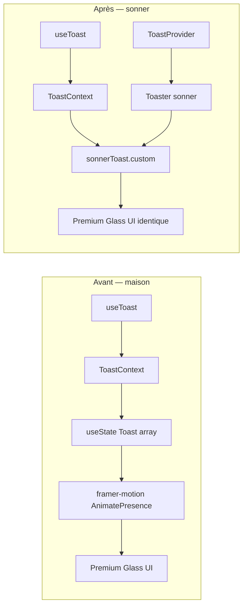

# Phase A.1 — Migration Toast → Sonner

> **Date :** 2026-05-31  
> **Statut :** ✅ Validée (TypeScript `tsc --noEmit` exit 0)  
> **Scope :** `components/Toast.tsx` réécrit — `app/layout.tsx` **non modifié**

---

## 1. Objectif

Remplacer le moteur de notifications React maison (Context + `useState` + `framer-motion`) par **sonner**, tout en :

- conservant la signature publique `useToast()` / `ToastProvider` ;
- préservant l'esthétique **Premium Glass** via `sonnerToast.custom()` ;
- évitant toute modification des ~25 consommateurs et du point d'injection layout.

---

## 2. Fichiers impactés

| Fichier | Action |
|---------|--------|
| `components/Toast.tsx` | **Réécrit intégralement** — sonner + wrapper custom |
| `app/layout.tsx` | **Aucune modification** — `<ToastProvider>` inchangé |
| ~25 consommateurs `useToast()` | **Aucune modification** — contrat API préservé |

---

## 3. Contrat API — inchangé

```typescript
// Hook
const { toast } = useToast();

// Signature
toast(message: string, type?: 'success' | 'error' | 'info', options?: ToastOptions) => void

// Type exporté
export type ToastOptions = {
  action?: { label: string; onClick: () => void };
  durationMs?: number;
  tone?: 'default' | 'ember';
};
```

**Exports publics conservés :** `useToast`, `ToastProvider`, `ToastOptions`.

---

## 4. Architecture avant / après



| Aspect | Avant | Après |
|--------|-------|-------|
| Moteur | `useState` + `setTimeout` | sonner queue native |
| Animation | framer-motion spring | sonner (custom sans wrapper motion) |
| Rendu UI | inline dans Provider | `sonnerToast.custom((id) => …)` |
| `<Toaster />` | absent | embarqué dans `ToastProvider` |
| Dépendance retirée du toast | — | `framer-motion` n'est plus importé par `Toast.tsx` |

---

## 5. Détails d'implémentation

### 5.1 Premium Glass via `custom()`

Chaque appel `toast()` déclenche :

```typescript
sonnerToast.custom(
  (id) => (
    <div className={`… rounded-[2.5rem] backdrop-blur-3xl ${variantClass}`}>
      {/* icône lucide-react + message + action CTA + bouton dismiss */}
    </div>
  ),
  { duration: durationMs }
);
```

- **Variants CSS** : identiques à l'ancien système (`toastVariants` success/error/info + `emberVariant`).
- **Action CTA** : `options.action.onClick()` puis `sonnerToast.dismiss(id)`.
- **Fermeture manuelle** : bouton `X` → `sonnerToast.dismiss(id)`.

### 5.2 Durées

| Cas | Durée |
|-----|-------|
| Défaut | 4 000 ms |
| Avec `action` | 10 000 ms |
| `durationMs` explicite | valeur fournie |

Logique identique à l'ancien `addToast`.

### 5.3 `<Toaster />` (embarqué dans Provider)

```tsx
<Toaster position="top-right" expand={false} visibleToasts={3} offset="4rem" />
```

| Prop | Valeur | Équivalent ancien |
|------|--------|-------------------|
| `position` | `top-right` | `fixed top-16 right-4` |
| `offset` | `4rem` | `top-16` (64 px sous le haut) |
| `visibleToasts` | `3` | empilement illimité → queue limitée à 3 visibles |
| `expand` | `false` | pas d'expansion au hover |

### 5.4 Différences visuelles mineures attendues

- **Animation entrée/sortie** : sonner par défaut (plus de spring framer-motion explicite).
- **Largeur** : `w-full sm:w-[384px]` (≈ `max-w-sm` 384 px sur desktop).
- **strokeWidth icônes** : `1.5` au lieu de `1` (micro-ajustement visuel).

---

## 6. Consommateurs — compatibilité

Aucun fichier consommateur modifié. Inventaire vérifié :

| Zone | Fichiers |
|------|----------|
| App pages | `feed`, `live`, `buy-points`, `invitations`, `notifications`, `profile/*`, `beef/[id]/summary`, `admin/*` |
| Composants | `BeefCard`, `Header`, `TikTokStyleArena`, `FollowButton`, `CreateBeefForm`, `EditBeefModal`, `ChatPanel`, `CommentsDrawer`, `MessagesUI`, `ReportBlockModal`, `FollowListModal`, `GlobalDuelAmbush`, `MediationBeefEditorPanel` |
| Injection | `app/layout.tsx` → `ToastProvider` (inchangé) |

### Options avancées — mapping sonner

| Option | Call sites | Comportement post-migration |
|--------|------------|----------------------------|
| `durationMs: 6500` | `FollowButton.tsx` | `{ duration: 6500 }` |
| `action: { label, onClick }` | `TikTokStyleArena.tsx` (×2) | bouton CTA custom + dismiss |
| `tone: 'ember'` | aucun call site actuel | `emberVariant` prêt si besoin futur |

---

## 7. Validation TypeScript

```bash
npx tsc --noEmit
# exit code: 0
```

Aucune erreur de typage sur les 25+ consommateurs ni sur le wrapper sonner.

---

## 8. Dépendances

| Package | Version | Rôle |
|---------|---------|------|
| `sonner` | `^2.0.7` | moteur toast + `<Toaster />` |
| `lucide-react` | existant | icônes Check / AlertCircle / Info / X |
| `framer-motion` | existant (autres composants) | **retiré de Toast.tsx** |

---

## 9. Hors scope (inchangé)

- **`BeefNotificationToasts`** (`Header.tsx`) — système parallèle beef live, indépendant de `ToastProvider`.
- **`app/layout.tsx`** — pas de `<Toaster />` séparé ; le Provider embarque son propre moteur sonner.

---

## 10. Checklist de test manuel

- [ ] Toast success / error / info depuis le feed ou le profil
- [ ] Toast avec action « Recharger » dans l'arène (solde insuffisant)
- [ ] Toast `durationMs: 6500` sur erreur prestige (`FollowButton`)
- [ ] Empilement de 3+ toasts → queue sonner (`visibleToasts={3}`)
- [ ] Position `top-right` + offset sous le header mobile
- [ ] Fermeture manuelle (X) et auto-dismiss après délai

---

## 11. Prochaines étapes suggérées

1. Test visuel en dev (`npm run dev`) sur mobile + desktop.
2. Commit sur branche de travail si validé visuellement.
3. Fusion dans `main` avant déploiement Vercel/prod.

---

*Phase A.1 terminée — wrapper sonner opérationnel, interface publique préservée.*
