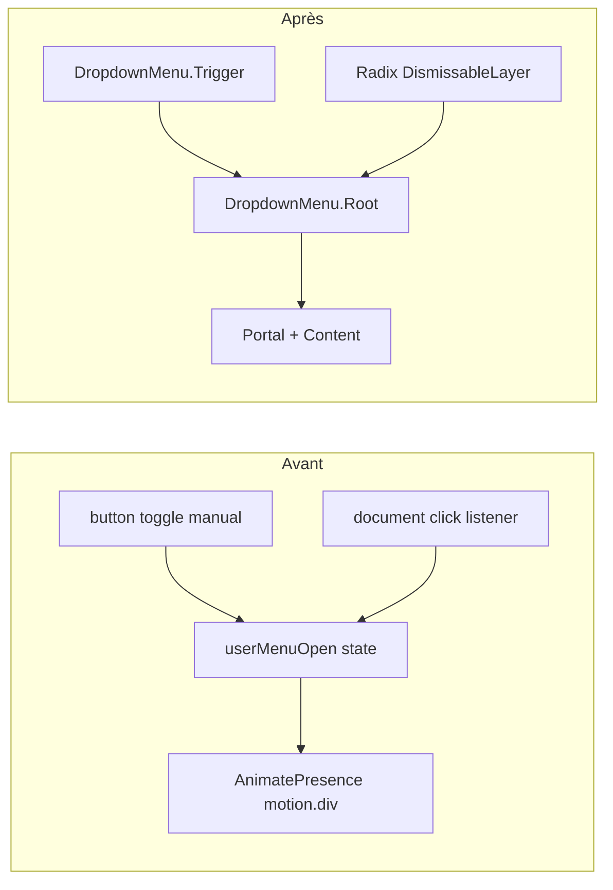

# Phase A.2 — Migration menu utilisateur Header → Radix Dropdown

> **Date :** 2026-05-31  
> **Statut :** ✅ Validée (`npx tsc --noEmit` exit 0)  
> **Fichier modifié :** `components/Header.tsx`

---

## 1. Objectif

Remplacer le menu utilisateur maison (`<div data-user-menu>` + `AnimatePresence` + listener document) par `@radix-ui/react-dropdown-menu`, en supprimant l'écouteur global toxique et en préservant le design Premium Glass.

---

## 2. Changements appliqués

| Étape | Action | Résultat |
|-------|--------|----------|
| 1 | Import Radix | `import * as DropdownMenu from '@radix-ui/react-dropdown-menu'` |
| 2 | Purge listener | **Supprimé** `useEffect` `handleClickOutside` (ex-L189–196) |
| 3 | Injection UI | `<div data-user-menu>` → `DropdownMenu.Root/Trigger/Portal/Content/Item` |
| 4 | Validation TS | Aucune erreur |

---

## 3. Purge du listener global — confirmée

### Avant (supprimé)

```typescript
useEffect(() => {
  const handleClickOutside = (event: MouseEvent) => {
    const target = event.target as HTMLElement;
    if (userMenuOpen && !target.closest('[data-user-menu]')) setUserMenuOpen(false);
  };
  document.addEventListener('click', handleClickOutside);
  return () => document.removeEventListener('click', handleClickOutside);
}, [userMenuOpen]);
```

### Après

- **Aucune** occurrence de `handleClickOutside` dans `Header.tsx`
- **Aucune** occurrence de `data-user-menu`
- Fermeture extérieure : **DismissableLayer Radix** (clic backdrop, Escape, focus management)

### Listeners document conservés (hors scope)

| Listener | Rôle |
|----------|------|
| `visibilitychange` | Resync badges au retour onglet |
| *(window)* `beefs:badges-refresh` | Refresh badges nav |

---

## 4. Architecture avant / après



---

## 5. Composants Radix injectés

```tsx
<DropdownMenu.Root open={userMenuOpen} onOpenChange={setUserMenuOpen}>
  <DropdownMenu.Trigger asChild>
    <button … focus-visible:ring-2 focus-visible:ring-cyan-400>
      {/* avatar + username + ChevronDown */}
    </button>
  </DropdownMenu.Trigger>
  <DropdownMenu.Portal>
    <DropdownMenu.Content
      side={shell === 'phone' ? 'top' : 'bottom'}
      align={shell === 'phone' ? 'start' : 'end'}
      sideOffset={8}
      className="z-[9999] w-60 rounded-2xl border border-white/10 bg-black/80 shadow-card backdrop-blur-2xl …"
    >
      {/* header profil + items + déconnexion */}
    </DropdownMenu.Content>
  </DropdownMenu.Portal>
</DropdownMenu.Root>
```

### Positionnement

| Shell | `side` | `align` | Équivalent ancien |
|-------|--------|---------|-------------------|
| `phone` (sidebar lg) | `top` | `start` | `lg:bottom-full lg:mb-2 lg:left-0` |
| `full` (top bar) | `bottom` | `end` | `absolute right-0 mt-2` |

---

## 6. Design Premium Glass — préservation

| Élément | Classes conservées |
|---------|-------------------|
| Panneau | `rounded-2xl border border-white/10 bg-black/80 shadow-card backdrop-blur-2xl` |
| Header profil | `dropdown-divider-bottom`, typo identique |
| Items nav | `px-4 py-2.5 text-gray-300 hover:bg-white/[0.04]` |
| Buy points | `buyPointsAnchorClass` + focus Radix |
| Déconnexion | `text-cyan-400 hover:bg-cyan-500/[0.08]` + `dropdown-divider-top` |
| Trigger | Avatar glass + `hover:bg-white/[0.06]` + ring focus accessible |

### Animations

Classes Tailwind ajoutées sur `DropdownMenu.Content` :
`data-[state=open]:animate-in`, `fade-in-0`, `zoom-in-95`, `slide-in-from-*`

**Note :** le projet n'a pas `tailwindcss-animate` installé au moment de la migration — les classes `animate-in`/`animate-out` peuvent être inactives sans ce plugin. Le rendu statique glass reste intact ; ajouter `tailwindcss-animate` si les transitions Radix data-state sont souhaitées visuellement.

---

## 7. État `userMenuOpen` — comportement conservé

| Mécanisme | Statut |
|-----------|--------|
| `useState` + contrôle Radix `open`/`onOpenChange` | ✅ |
| Reset au changement de `pathname` (L174–177) | ✅ inchangé |
| Fermeture explicite sur navigation / buy-points / signOut | ✅ via `setUserMenuOpen(false)` |
| Rotation `ChevronDown` | ✅ `${userMenuOpen ? 'rotate-180' : ''}` |

---

## 8. Items menu — mapping Radix

| Entrée | Composant Radix | Navigation |
|--------|-----------------|------------|
| Profil | `DropdownMenu.Item asChild` + `Link` | `hrefWithFrom` |
| Acquérir de l'Aura | `DropdownMenu.Item asChild` + `button` | `openBuyPointsPage` |
| Convocations | `DropdownMenu.Item asChild` + `Link` | `hrefWithFrom` |
| Paramètres | `DropdownMenu.Item asChild` + `Link` | `hrefWithFrom` |
| Admin | conditionnel `userRole === 'admin'` | `hrefWithFrom` |
| Déconnexion | `DropdownMenu.Item asChild` + `button` | `signOut()` async |

---

## 9. Hors scope (inchangé)

- Menu mobile hamburger (`mobileMenuOpen`, backdrop inline)
- Nav principale, badges, Realtime Supabase, Elite sidebar
- `framer-motion` toujours utilisé pour nav indicators et mobile menu

---

## 10. Validation TypeScript

```bash
npx tsc --noEmit
# exit code: 0
```

---

## 11. Checklist de test manuel

- [ ] Ouverture/fermeture trigger (clic avatar)
- [ ] Fermeture clic extérieur (sans listener document custom)
- [ ] Touche Escape ferme le menu
- [ ] Navigation Profil / Paramètres / Convocations
- [ ] « Acquérir de l'Aura » → redirect buy-points
- [ ] Déconnexion
- [ ] Entrée Admin visible si `userRole === 'admin'`
- [ ] Position sidebar (`shell="phone"`, lg) : menu s'ouvre vers le haut
- [ ] Position top bar (`shell="full"`) : menu s'ouvre vers le bas
- [ ] Fermeture auto au changement de route
- [ ] Focus visible sur trigger et items (accessibilité)

---

## 12. Dépendances

```json
"@radix-ui/react-dropdown-menu": "^2.1.18"
```

---

*Phase A.2 terminée — listener document purgé, menu Radix opérationnel.*
