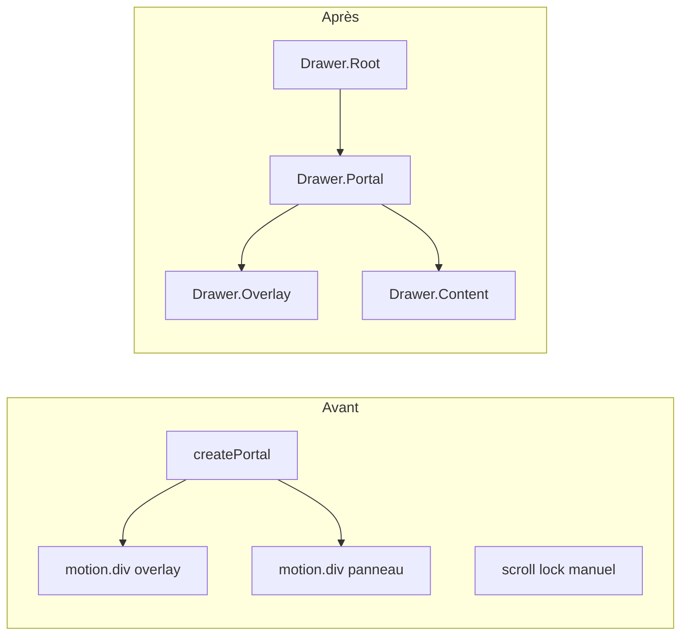

# Phase A.3 — Migration CommentsDrawer → vaul

> **Date :** 2026-05-31  
> **Statut :** ✅ Validée (`npx tsc --noEmit` exit 0)  
> **Fichier modifié :** `components/CommentsDrawer.tsx`

---

## 1. Objectif

Remplacer la surcouche UI maison (`createPortal` + `framer-motion` + scroll lock manuel) par **vaul**, tout en préservant intégralement la logique métier (fetch Supabase, envoi, Aura, réponses imbriquées) et le design Premium Glass.

---

## 2. Changements appliqués

| Étape | Action | Résultat |
|-------|--------|----------|
| 1 | Imports | `Drawer` from `vaul` — retrait `createPortal`, `motion` |
| 2 | Purge scroll lock | Suppression `useEffect` `document.body.style.overflow` |
| 3 | Squelette UI | `Drawer.Root/Portal/Overlay/Content` |
| 4 | Validation TS | Aucune erreur |

---

## 3. Imports — avant / après

### Retirés

```typescript
import { createPortal } from 'react-dom';
import { motion } from 'framer-motion';
```

### Ajouté

```typescript
import { Drawer } from 'vaul';
```

---

## 4. Purge scroll lock — confirmée

### Supprimé

```typescript
useEffect(() => {
  if (typeof document === 'undefined') return;
  document.body.style.overflow = 'hidden';
  return () => {
    document.body.style.overflow = 'unset';
  };
}, []);
```

**Remplacement :** vaul gère le scroll lock nativement via `Drawer.Root`.

---

## 5. Architecture UI — avant / après



### Configuration vaul

```tsx
<Drawer.Root
  open={true}
  onOpenChange={(open) => { if (!open) onClose(); }}
  direction={isMobile ? 'bottom' : 'right'}
>
```

| Breakpoint | `direction` | Comportement |
|------------|-------------|--------------|
| Mobile (`≤767px`) | `bottom` | Bottom sheet 80dvh, poignée drag |
| Desktop | `right` | Slide-over 450px depuis la droite |

---

## 6. Logique métier — inchangée

| Élément | Statut |
|---------|--------|
| Props `beefId`, `onClose` | ✅ |
| `fetchComments` (beef_comments + likes) | ✅ |
| `handleSend` (INSERT + refetch) | ✅ |
| `toggleCommentAura` (beef_comment_likes) | ✅ |
| `renderComment` + réponses imbriquées | ✅ |
| `StarField`, `InlineAuraGivers`, `useToast` | ✅ |
| Gate SSR `mounted` | ✅ conservé |

---

## 7. Design Premium Glass — préservation

| Zone | Classes |
|------|---------|
| Overlay | `bg-black/40 backdrop-blur-sm z-[9999]` |
| Content | `bg-black/40 backdrop-blur-sm border-white/10 shadow-2xl` |
| Mobile | `80dvh`, `rounded-t-3xl`, poignée drag `bg-white/20` |
| Desktop | `h-full w-[450px] border-l` |
| Footer | `bg-black/60 backdrop-blur-md`, safe-area-inset |
| Input | `rounded-full border-white/10 bg-white/5` |

---

## 8. Parent feed — note

`app/feed/page.tsx` conserve encore :

```tsx
<AnimatePresence>
  {activeCommentsBeefId && <CommentsDrawer … />}
</AnimatePresence>
```

Le wrapper `AnimatePresence` est **redondant** post-vaul (plus de props `exit` framer-motion dans le drawer). Retrait optionnel en phase ultérieure — **non bloquant** fonctionnellement.

---

## 9. Validation TypeScript

```bash
npx tsc --noEmit
# exit code: 0
```

---

## 10. Checklist de test manuel

- [ ] Ouverture depuis feed (icône commentaires BeefCard)
- [ ] Mobile : slide depuis le bas + poignée drag + swipe dismiss
- [ ] Desktop : slide depuis la droite
- [ ] Overlay clic → fermeture
- [ ] Fetch commentaires + spinner
- [ ] Envoi commentaire + Enter
- [ ] Réponse imbriquée + bandeau `@username`
- [ ] Toggle Aura (Sparkles) + `InlineAuraGivers`
- [ ] Fond étoilé `StarField` visible à travers le verre
- [ ] Safe area bottom sur mobile (input footer)

---

## 11. Dépendances

```json
"vaul": "^1.1.2"
```

---

*Phase A.3 terminée — drawer vaul opérationnel, logique métier intacte.*
